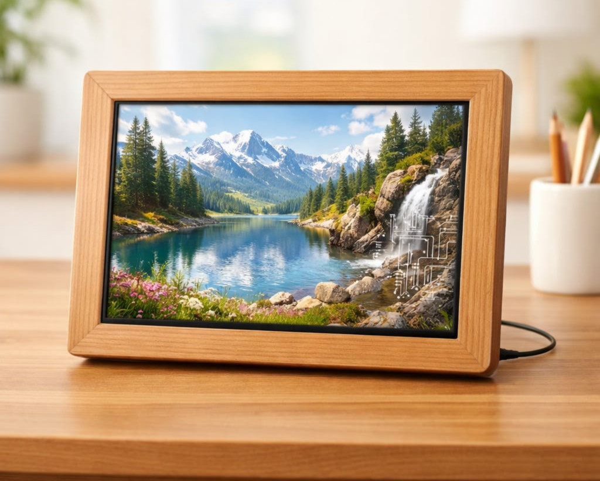

# MuralPicta – WallPanel Server


## A self-hosted image and video browser slideshow server e. g. for wall panels and tablets.
Runs completely local and independently — no cloud service required.

---
## ⚠️ This repository is still under development. Do not use it until these lines are removed.⚠️
---

## Features

- Full-screen slideshow with Ken Burns effect and crossfade transitions
- Supports images and videos from NAS/network shares (SMB/mount)
- EXIF metadata display with GPS reverse geocoding
- Web-based admin interface at `/admin`
- External path control via URL query parameter (`?media_path=2026/Summer`)
- Optional PIN protection for the admin panel

## Quick Start (Docker)

```bash
# 1. Copy and edit the environment file
cp wallpanel_webserver/docker/.env.example wallpanel_webserver/docker/.env

# 2. Edit .env: set MEDIA_PATH to your media folder
#    Example: MEDIA_PATH=/volume1/medien

# 3. Start
cd wallpanel_webserver/docker
docker compose up -d

# 4. Open in browser
#    Slideshow: http://localhost:3000
#    Admin:     http://localhost:3000/admin
```

## Multiple Media Folders

You can mount several NAS shares or folders side by side:

```yaml
volumes:
  - /volume1/2024:/data/media/2024:ro
  - /volume1/2025:/data/media/2025:ro
  - /volume1/2026:/data/media/2026:ro
```

Set `media_base_path` to `/data/media` in the admin. The scanner finds all files recursively.

## Without Docker

```bash
cd wallpanel_webserver
npm install
npm run build:admin
npm start
```

## Configuration

All settings are managed through the admin interface at `/admin`.
Configuration is stored in `wallpanel_webserver/config/config.json` (not versioned).

## Documentation

- `CLAUDE.md` — project context and architecture (for developers)
- `wallpanel_webserver/docker/docker-compose.yml` — annotated Docker Compose example

## License

GPL-3.0-only — see [LICENSE](LICENSE)
