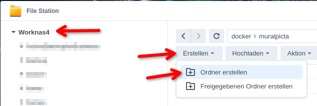
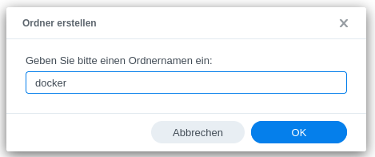
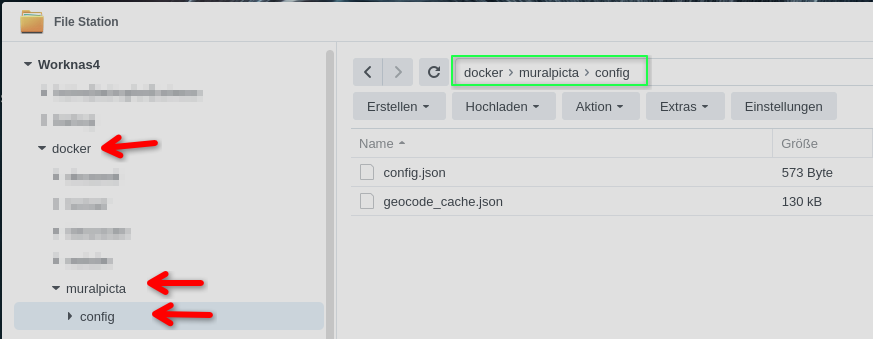

# MuralPicta – How to install on Synology

Installing MuralPicta on a Synology NAS via Docker takes just a few minutes.

## A great general resource for Synology installations

One of the best places to learn about Docker on Synology is [mariushosting.com](https://mariushosting.com/).
His guides have helped countless users over the years — if you find his work useful, consider buying him a coffee.
His work is truly remarkable and can save you hours of trial and error.

**Installing via Portainer**  
Marius describes the Portainer installation at [mariushosting.com](https://mariushosting.com/synology-30-second-portainer-install-using-task-scheduler-docker/).
Portainer is a great alternative to Synology's built-in Container Manager. Both work fine — choose whichever feels more comfortable.
For this guide, we use the built-in **Container Manager** as it requires no extra installation.

---

## Step 1 – Prepare the folder structure

Open **File Station** and create the following folder structure on your NAS:

```
/volume1/
└── docker/
    └── muralpicta/
        └── config/
```

> Make sure to use lowercase for all folder names.

Create the `docker` folder on the top level of your volume:




Then open the `docker` folder and create a subfolder named `muralpicta`.  
Inside that, create one more subfolder named `config`.

The result should look like this:



---

## Step 2 – Create the stack in Container Manager

Open **Container Manager** → **Project** → **Create**.

Give the project a name (e.g. `muralpicta`) and paste the contents of  
[`docker/docker-compose.synology.yml`](../../wallpanel_webserver/docker/docker-compose.synology.yml)  
into the compose editor.

**Before saving**, adjust the media volume path to point to your actual photo/video share:

```yaml
volumes:
  - /volume1/docker/muralpicta/config:/app/config:rw
  - /volume1/photo:/data/media:ro   # ← change /volume1/photo to your share
```

If port `3000` is already in use on your NAS, change the left side of the port mapping:

```yaml
ports:
  - "3123:3000"   # ← use any free port
```

Click **Next** and then **Done** to start the container.

---

## Step 3 – Open the admin interface

Once the container is running, open your browser and navigate to:

```
http://<NAS-IP>:3000/admin
```

In the admin, go to **Media Sources** and set the **Media Base Path** to:

```
/data/media
```

---

## Step 4 – Exclude Synology system folders

Synology creates hidden working folders like `@eaDir` inside your photo directories.
These contain thumbnails and metadata files that would otherwise appear in the slideshow.

To exclude them, go to **Admin → Filter & Exclusion** and add the following exclude pattern:

```
^@
```

This hides all folders and files starting with `@`.

> **Important:** Without this filter you will see low-resolution thumbnails and images without EXIF metadata (no GPS, no capture date).

---

## Updating MuralPicta

To update to a new version:

1. Open **Container Manager** → **Registry** and pull the latest `galseq/mural-picta` image.
2. Stop and re-deploy the project (Container Manager will use the new image automatically).
3. Your configuration in `/volume1/docker/muralpicta/config` is preserved.

---

## Resetting the PIN

If you have forgotten your admin PIN, you can reset it by deleting or editing `config.json`:

1. Open **File Station** → `/docker/muralpicta/config/`
2. Open `config.json` and remove the `"adminPin"` field (or set it to `""`)
3. Restart the container — PIN protection is now disabled

---

## Troubleshooting

| Problem | Possible cause | Solution |
|---|---|---|
| Container fails to start | Config folder missing | Create `/volume1/docker/muralpicta/config` via File Station |
| Media folder not accessible | Wrong volume path | Check the left side of the volume mount in the compose file |
| Images show without GPS/date | `@eaDir` folders included | Add `^@` exclude filter in Admin → Filter |
| Port already in use | Another service uses port 3000 | Change the left port number in the compose file |
| Page not reachable | Firewall / port blocked | Check Synology firewall rules for the chosen port |
